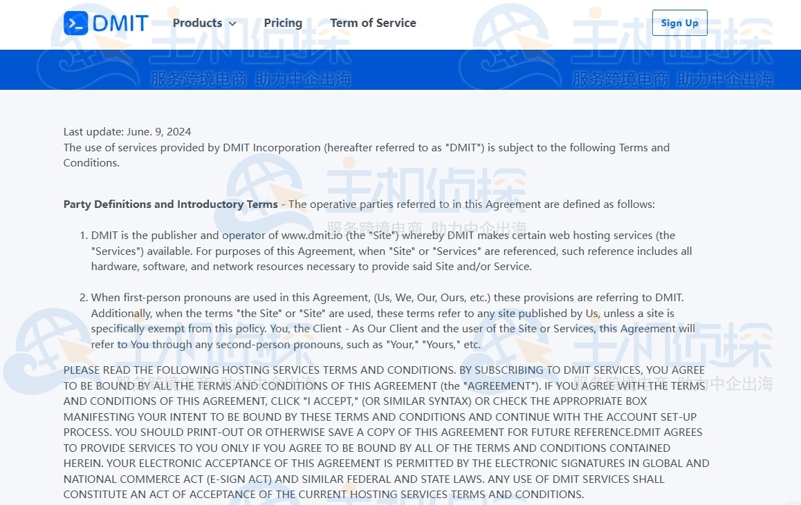
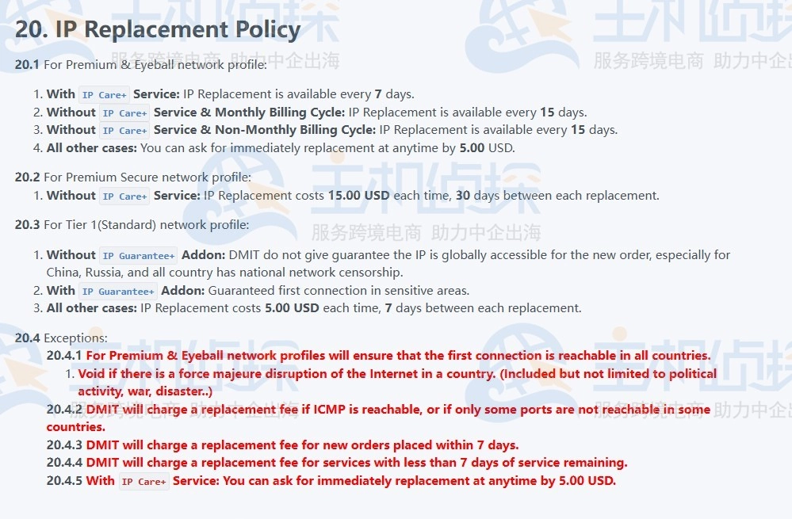

# DMIT Updates IP Replacement Policy: Free IP Changes Now Available Across Product Lines

---

For users running cloud services or VPS instances, IP accessibility can make or break your operations. Whether you're managing global deployments or testing new markets, getting stuck with a blocked IP means downtime, lost revenue, and frustrated customers. 

DMIT just rolled out a major policy shift that benefits most users—especially those on budget-friendly plans. Instead of charging by region, they're now standardizing IP replacement rules across product lines. This means Hong Kong and Tokyo Eyeball series customers who previously paid for every IP swap can now change IPs for free under the same conditions as Los Angeles users. If you're on popular plans like the $36, $39, or $49 deals, you just gained a significant operational advantage without spending extra.

---

## What Changed in the New Policy

On June 9th, DMIT switched from region-based IP replacement fees to product-tier-based rules. Previously, HKG (Hong Kong) and TYO (Tokyo) regions charged fees for IP changes on certain plans, while LAX (Los Angeles) had more flexible terms. Now, all regions follow unified guidelines based on network configuration type rather than geographic location.

The biggest winners here are Eyeball series users in Hong Kong and Tokyo. Before this update, any IP change meant pulling out your wallet. Now they're treated exactly like LAX customers—free replacements under specific conditions.

## Breaking Down the New Rules

DMIT divides their policy into three network configuration categories. Each has different rules depending on whether you've purchased add-on services.

**For Premium & Eyeball Network Configurations:**

- With IP Care+ service: Change IP once every 7 days
- Without IP Care+ on monthly billing: Change IP once every 15 days  
- Without IP Care+ on other billing cycles: Change IP once every 15 days
- All other cases: Pay $5.00 per replacement anytime

**For Premium Secure Network Configurations:**

- Without IP Care+ service: $15.00 per change, with 30-day intervals between replacements

**For Tier 1 (Standard) Network Configurations:**

- Without IP Guarantee+ add-on: DMIT doesn't guarantee global IP accessibility on new orders, though they generally work worldwide including China and Russia
- With IP Guarantee+ add-on: Guaranteed first connection in sensitive regions
- All other cases: $5.00 per change with 7-day intervals

If you're trying to optimize server costs while maintaining flexibility, 👉 [this DMIT pricing structure lets you balance budget and reliability without sacrificing network quality](https://www.dmit.io/aff.php?aff=13832). The ability to change IPs freely on lower-tier plans means you're not locked into expensive options just for basic IP management.

## Important Exceptions to Know

DMIT added four exception clauses that apply across all tiers:

1. **Force majeure protection**: For Premium & Eyeball configurations, first-connection guarantees become void during internet disruptions caused by political events, wars, or disasters
2. **Partial blocking charges**: You'll pay replacement fees if ICMP is reachable or only some ports are blocked in certain countries
3. **New order grace period**: Replacement fees apply within 7 days of placing a new order
4. **Service end charges**: Fees apply if less than 7 days remain on your service
5. **IP Care+ override**: With this add-on, you can always pay $5.00 for immediate replacement regardless of timing

These exceptions matter because they define when "free" actually costs money. If you order a new VPS and the IP works but one port is blocked somewhere, that's on you to pay. But if the entire IP is dead on arrival, you're covered.

## Who Benefits Most From This Change

Let's be real—this policy helps three groups of users significantly:

**Budget-conscious developers**: Those $36-$49 promotional plans now include free IP changes. If you're testing different markets or running A/B tests across regions, you're not bleeding $5-15 per swap anymore.

**Hong Kong and Tokyo users**: Previously second-class citizens on Eyeball plans, now enjoying LAX-level treatment. If you picked HKG or TYO for latency reasons but hated the IP change fees, that pain point just disappeared.

**High-churn operations**: Running scrapers, testing bots, or managing multiple client projects that occasionally need fresh IPs? The 7-15 day rotation windows (depending on your plan) give you predictable scheduling without surprise charges.

For teams managing multi-region deployments, 👉 [DMIT's unified policy across their LAX, HKG, and TYO locations simplifies infrastructure planning when you need consistent IP management rules](https://www.dmit.io/aff.php?aff=13832). No more tracking different policies per region or building separate budgets for each datacenter.

## What This Means for Your Operations

The practical impact depends on your use case. If you're running stable, long-term services that rarely need IP changes, this update won't affect your day-to-day. But if you're in any of these situations, you just got a meaningful upgrade:

- **Market testing**: Launching services in new geographic regions where IP reputation is unknown
- **Content delivery**: Managing multiple endpoints where occasional IP blocks happen
- **Development environments**: Spinning up test instances that might get flagged during security testing
- **Cost optimization**: Choosing lower-tier plans without sacrificing operational flexibility

The shift from region-based to product-based pricing also signals something important about DMIT's infrastructure maturity. When a provider can standardize policies across datacenters, it usually means their backend automation and IP pool management have reached a level where geographic location matters less than service tier.

## Comparing to Industry Standards

Most cloud providers either charge per IP change or offer zero flexibility. AWS Elastic IPs are free while attached but cost money when idle. DigitalOcean charges $4/month for additional IPs. Vultr offers free IP replacement but with manual approval processes that can take hours.

DMIT's approach sits in a sweet spot—automated changes without manual ticket submissions, reasonable cooldown periods to prevent abuse, and clear pricing for when you need faster turnaround. The $5 expedited option is cheaper than most competitors' standard fees.

## How to Actually Use This Policy

Knowing the rules and using them effectively are different things. Here's the operational reality:

For monthly billing without IP Care+, you get one free change every 15 days. Mark your calendar. If you're running into IP issues on day 14, wait 24 hours instead of paying $5. If you're on day 3 and desperately need a new IP, $5 is your fastest option.

IP Care+ costs extra monthly but drops the cooldown to 7 days. Do the math on your specific situation. If you historically change IPs more than once per month, the add-on probably pays for itself. If you're changing IPs weekly, it definitely does.

For Premium Secure configurations, the $15 fee and 30-day cooldown mean you really need to plan ahead. This tier is clearly designed for high-security applications where IP changes are rare but necessary. If you're regularly hitting that 30-day window, you might be on the wrong product tier.

---

## Conclusion

DMIT's policy update removes a significant pain point for budget and mid-tier users who previously paid premium prices for basic IP management features. By standardizing rules across regions and tying them to product lines instead of geography, they've simplified operations while reducing costs for Hong Kong and Tokyo customers.

The real value here isn't just free IP changes—it's predictable infrastructure management. You can now build deployment strategies knowing exactly when and how you can refresh IPs without surprise fees eating into margins. For teams running lean operations or testing new markets, this flexibility matters more than the dollar amounts involved.

If you're evaluating cloud providers and IP management flexibility factors into your decision, this policy puts DMIT ahead of competitors who either charge universally or make you open support tickets for every change. The combination of automated processes, clear cooldown periods, and reasonable expedited fees creates a system that actually works for real-world operations.
